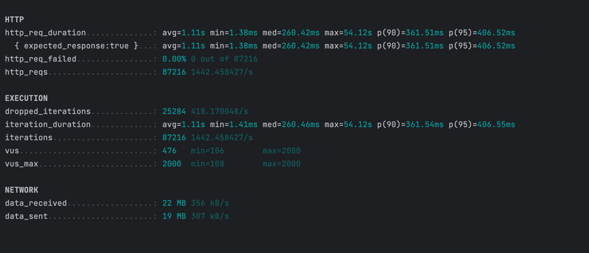
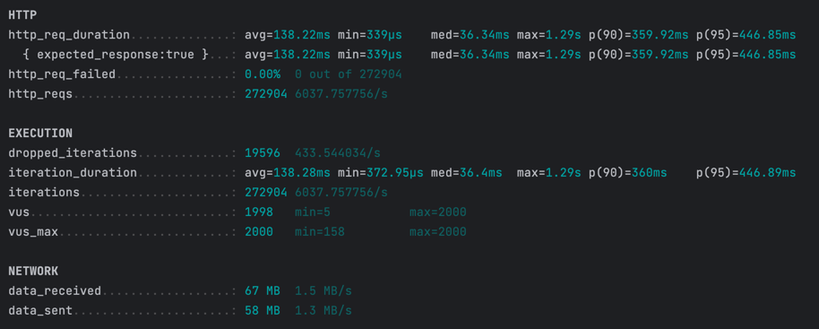
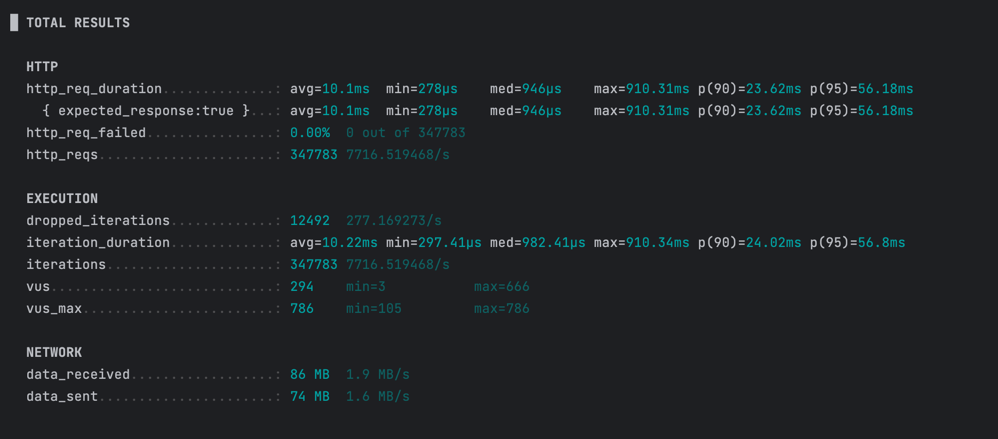

Запуск

```python proxy/main.py config.yaml```

## Тесты

#### Конфиг сервера


rate: 2500, workers=1 -> 1500 RPS


rate: 6500, workers=8 -> 6000 RPS


rate: 8000, workers=8, logs off -> 7700 RPS
