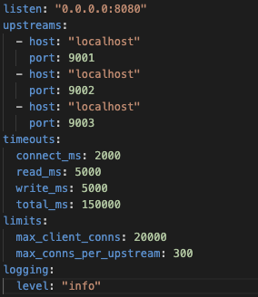
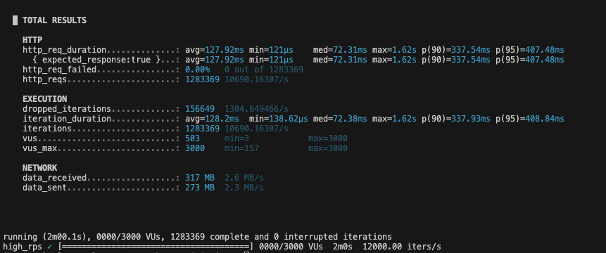
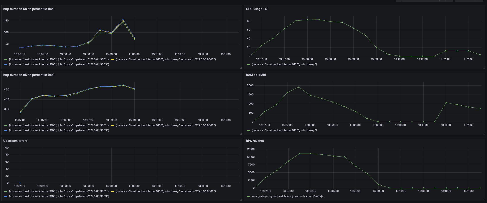
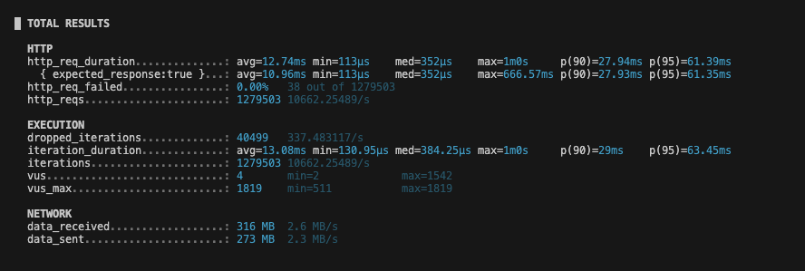
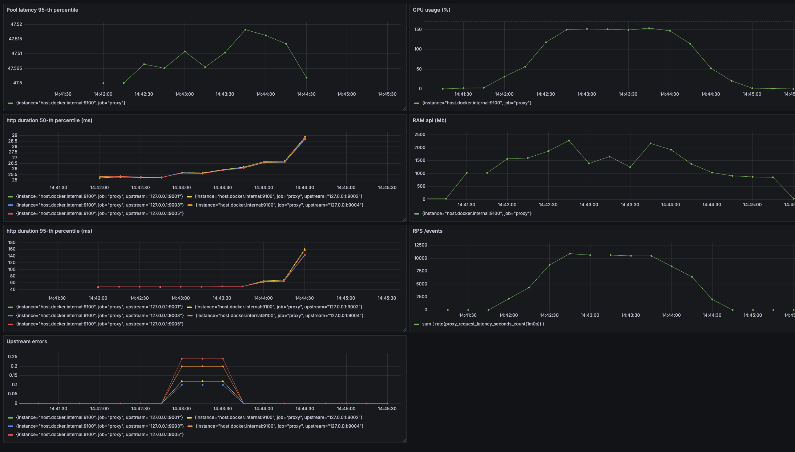

Запуск

```python proxy/main.py config.yaml```

## Тесты

#### GOMAXPROCS=1


rate: 12000, maxVU: 3000 -> 10500 RPS, CPU -> 82%, p95 -> 400ms



#### GOMAXPROCS=8
rate: 12000, maxVU: 3000 -> 10500 RPS, CPU -> 150%, p95 -> 61ms


